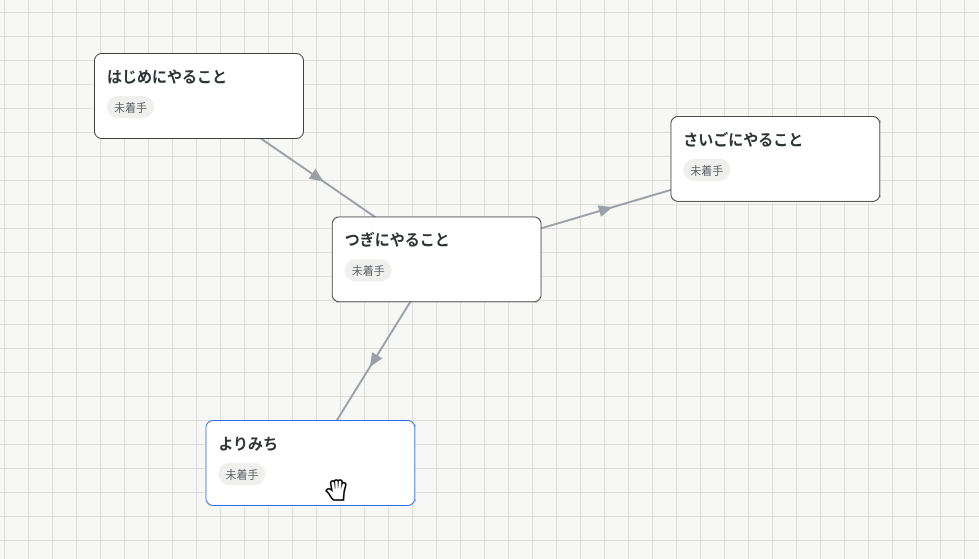
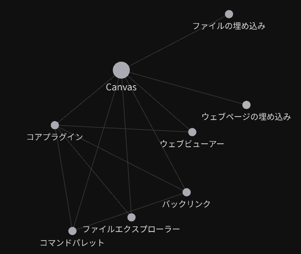
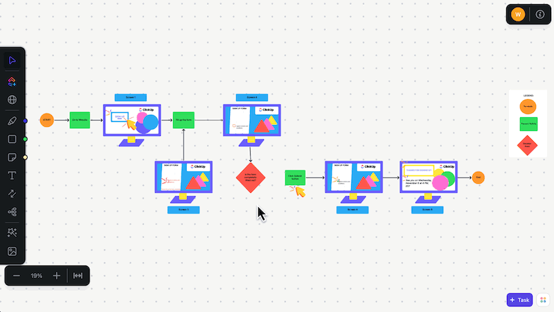

<!--
目安は10分
-->

<!-- _class: lead -->
<!-- _paginate: false -->
<!-- _footer: "" -->

# キャンバス型Todoアプリ

 
 
 

2026年07月24日
3班　今井・杉山・鍋島・西谷

<!--
00m20s
00m20s

3班の発表をはじめます。よろしくお願いします。
まあみなさん「キャンバス型ってなんやねん」という感じだと思いますが、
-->

## キャンバス型とは？

> タスクをキャンバス上に自由に配置して管理できるTodoアプリです。

  

<!--
00m40s
01m00s

こんな感じで、タスクをキャンバス上に自由に配置して管理できるTodoアプリです。
このタスクを掴んでいろいろ動かしてみたり、線でつなげてみたり、という感じのことができます。
-->

## 使用技術

- HTML/CSS （標準 + TailwindCSS）
- TypeScript （Vite等は使用せず）
- Web Storage API （localStorage）

<!--
00m40s
01m40s

使用した技術としては、いわゆる"Web"、HTML/CSSと、
ここは少し変わり種なのですがJavaScriptではなくTypeScriptで書いています。
また、Vite等のビルドツールやその他ライブラリ等も使用せず、純粋にTypeScriptのコンパイラのみを用いています。
それから、データの保存・復元にはWeb Storage APIのlocalStorageを使用しています。
-->

## 実装した機能

- タスクの追加・編集・削除・配置・移動

- 接続の追加・削除

- キャンバスの追加・編集・削除・切り替え

- 保存・復元

- 元に戻す・やり直し

- タスクの検索・フィルタリング (キーワード・ステータス・距離)

<!--
00m40s
02m20s

実装した機能としては、(スライドを読み上げる)
という感じになっています。
-->

## 各担当箇所

  

### 今井

- HTML/CSS・
DOM操作・イベント処理

  

  

### 杉山

- 検索・フィルタリング機能

  

 

  

### 鍋島

- 保存・復元機能

  

  

### 西谷

- 元に戻す・やり直し機能

  

<!--
00m30s
02m50s

(スライドを読み上げる)
-->

## デモ

- **キャンバス**：追加・タイトル編集・切り替え・削除
- **タスク**：追加・編集・ドラッグ移動・削除
- **接続**：タスク同士の接続・接続線の削除
- **検索・フィルター**：キーワード・ステータス・距離で絞り込み
- **Undo / Redo**：操作を元に戻す・やり直す
- **保存・復元**：保存後、再読み込みして状態を復元

<!--
03m00s
05m50s
-->

## モジュール構成　（画面と状態管理）

  

### UI

`events.ts` / `renderer.ts`

- ユーザー操作の受付
- タスクカードの描画
- SVG接続線の描画
- メニューやダイアログの表示

  

  

### Application

`application.ts`

- アプリ全体の状態を管理
- タスク・接続などを操作
- 選択対象・操作モードを管理
- 他モジュールをつなぐ窓口

  

<!--
00m30s
06m20s
-->

## モジュール構成　（データと補助機能）

  

### Domain

`task.ts` / `canvas.ts`  
`connection.ts` など

- タスク・接続・キャンバスを表現
- 位置やステータスなどを保持
- アプリで扱うデータの形を定義

  

  

### 補助機能

`filter` / `history` /
`localStorage` など

- タスクの検索・絞り込み
- localStorageへの保存・復元
- Undo / Redoの履歴管理
- 保存データや入力値の検証

  

<!--
00m30s
06m50s
-->

## 操作から画面更新までの流れ

  

    <strong>① 操作</strong> 
    EventController
  

  
▼

  

    <strong>② 状態を変更</strong> 
    Application
  

  
▼

  

    <strong>③ 再描画</strong> 
    Renderer
  

<!--
00m20s
07m10s
-->

## 使用用途とターゲット

### 　複数のプロジェクトを同時に進行している個人クリエイター・開発者

- 授業課題や研究
- 個人開発
- 動画・記事・作品などを制作
- 小規模なイベントや企画を準備
- 情報を一覧より図で把握したい

<!--
01m00s
08m10s
-->

## 類似アプリについて

- Obsidian Canvas

  

  Obsidian Canvas ・
  <a href="https://obsidian.md/ja/help/plugins/canvas" class="small link">https://obsidian.md/ja/help/plugins/canvas</a>

<!--
00m30s
08m40s
-->

## 他にも色々あるが...

- ClickUp

  

  ClickUp Whiteboard ・
  <a href="https://clickup.com/ja/blog/35318/guide-to-whiteboards-in-clickup" class="small link">https://clickup.com/ja/blog/35318/guide-to-whiteboards-in-clickup</a>

> 大規模チーム向けで機能も多い

<!--
00m30s
09m10s
-->

---

<!-- _class: lead -->
<!-- _paginate: false -->
<!-- _footer: "" -->

  <h1>まとめ</h1>
   
  <h3>タスクの関係の近さでフィルターできるシンプルなキャンバス型Todoアプリ</h3>

 

  

    
QRコードからアクセスできます。→

    
  

   
  
または <a href="https://floating-gate.com/projects/todo2607">https://floating-gate.com/projects/todo2607</a> から

<!--
00m50s
10m00s
-->
