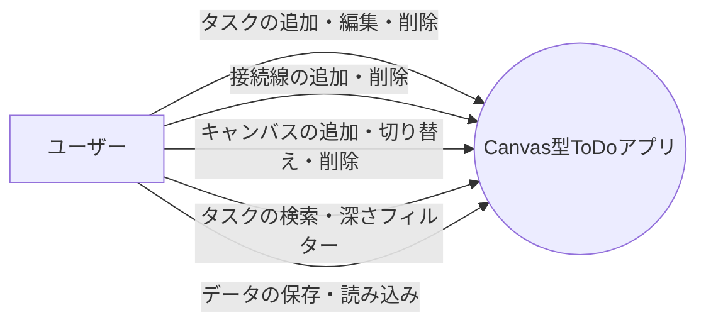
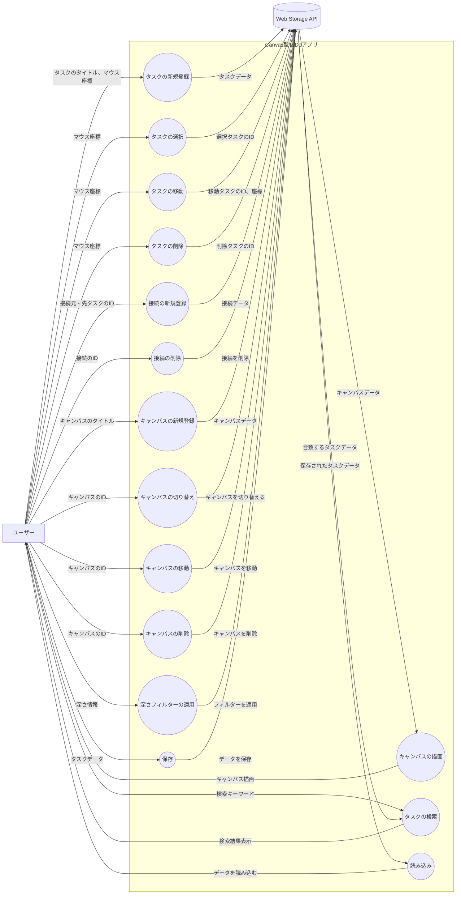

# DFD図

## レベル0ダイアグラム

```mermaid
flowchart LR
    user[ユーザー]
    process((Canvas型ToDoアプリ))

    user --> |タスクの追加・編集・削除| process
    user --> |接続線の追加・削除| process
    user --> |キャンバスの追加・切り替え・削除| process
    user --> |タスクの検索・深さフィルター| process
    user --> |データの保存・読み込み| process
```

## レベル1ダイアグラム
プロセスは`spec.md`4.1節で定義される操作一覧に基づいています。

```mermaid
flowchart LR
    user[ユーザー]

    subgraph Canvas型ToDoアプリ
        p0((キャンバスの描画))
        p1((タスクの新規登録))
        p2((タスクの選択))
        p3((タスクの移動))
        p4((タスクの削除))
        p5((タスクの検索))
        p6((接続の新規登録))
        p7((接続の削除))
        p8((キャンバスの新規登録))
        p9((キャンバスの切り替え))
        p10((キャンバスの移動))
        p11((キャンバスの削除))
        p12((深さフィルターの適用))
        p13((保存))
        p14((読み込み))
    end

    d0[(Web Storage API)]

    d0 --> |キャンバスデータ| p0 --> |キャンバス描画| user
    user --> |タスクのタイトル、マウス座標| p1 --> |タスクデータ| d0
    user --> |マウス座標| p2 --> |選択タスクのID| d0
    user --> |マウス座標| p3 --> |移動タスクのID、座標| d0
    user --> |マウス座標| p4 --> |削除タスクのID| d0
    user --> |検索キーワード| p5 
    d0 --> |合致するタスクデータ| p5 --> |検索結果表示| user
    user --> |接続元・先タスクのID| p6 --> |接続データ| d0
    user --> |接続のID| p7 --> |接続を削除| d0
    user --> |キャンバスのタイトル| p8 --> |キャンバスデータ| d0
    user --> |キャンバスのID| p9 --> |キャンバスを切り替える| d0
    user --> |キャンバスのID| p10 --> |キャンバスを移動| d0
    user --> |キャンバスのID| p11 --> |キャンバスを削除| d0
    user --> |深さ情報| p12 --> |フィルターを適用| d0
    user --> |タスクデータ| p13 --> |データを保存| d0
    d0 --> |保存されたタスクデータ| p14 --> |データを読み込む| user
```

