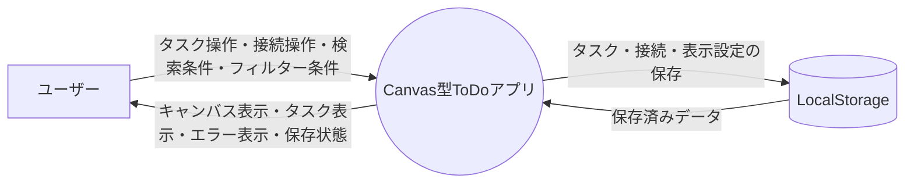
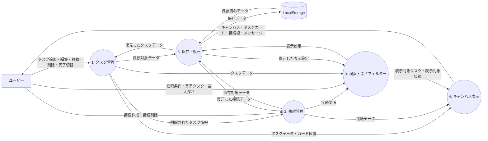

# DFD図

## レベル0

```mermaid
flowchart LR
    user[ユーザー]
    app((Canvas型ToDoアプリ))
    storage[(LocalStorage)]

    user -->|タスク操作・接続操作・検索条件・フィルター条件| app
    app -->|キャンバス表示・タスク表示・エラー表示・保存状態| user
    app -->|タスク・接続・表示設定の保存| storage
    storage -->|保存済みデータ| app
```

## レベル1

```mermaid
flowchart LR
    user[ユーザー]
    storage[(LocalStorage)]

    p1((1. タスク管理))
    p2((2. 接続管理))
    p3((3. 検索・深さフィルター))
    p4((4. キャンバス表示))
    p5((5. 保存・復元))

    user -->|タスク追加・編集・移動・削除・完了切替| p1
    p1 -->|タスクデータ・カード位置| p4
    p1 -->|保存対象データ| p5
    p1 -->|削除されたタスク情報| p2

    user -->|接続作成・接続削除| p2
    p2 -->|接続データ| p4
    p2 -->|保存対象データ| p5
    p2 -->|接続関係| p3

    user -->|検索条件・基準タスク・最大深さ| p3
    p1 -->|タスクデータ| p3
    p3 -->|表示対象タスク・表示対象接続| p4
    p3 -->|表示設定| p5

    p4 -->|キャンバス・タスクカード・接続線・メッセージ| user

    p5 -->|保存データ| storage
    storage -->|保存済みデータ| p5
    p5 -->|復元したタスクデータ| p1
    p5 -->|復元した接続データ| p2
    p5 -->|復元した表示設定| p3
```
