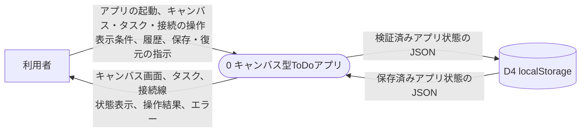
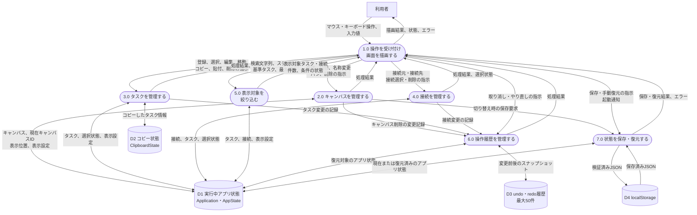
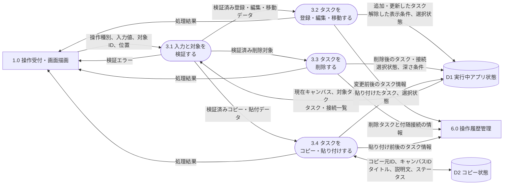
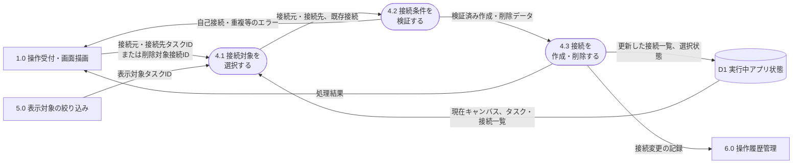
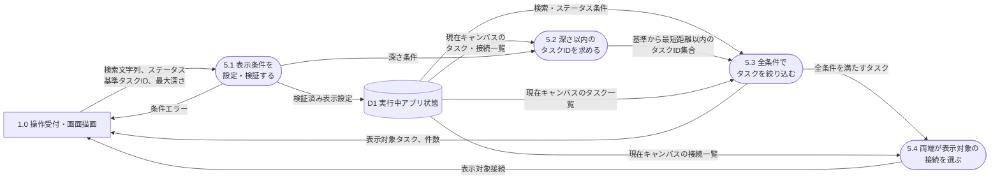
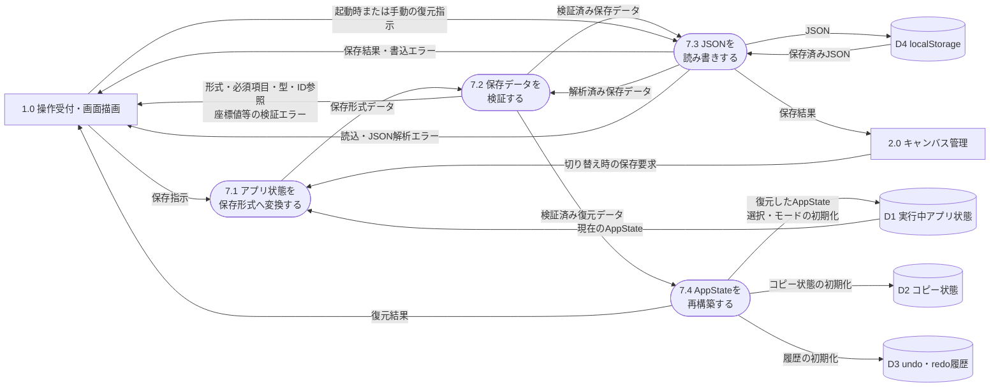

# DFD図

PDF だと少し見にくいです。VSCode拡張の Preview のほうが確認しやすいかもしれません。

## レベル0ダイアグラム

## レベル1ダイアグラム

レベル0のプロセス0を主要機能に分解する。D1からD3はメモリー上のデータ、D4はブラウザー内の永続データである。

## レベル2ダイアグラム

### 3.0 タスクを管理する

タスクの登録・編集・移動・削除と、コピー・貼り付けを分解して示す。タスク削除時には、そのタスクを端点とする接続も同時に削除する。

### 4.0 接続を管理する

接続は現在のキャンバス内にある、表示中の異なる2タスク間だけに作成する。同一方向の重複と自己接続は拒否する一方、逆向きの接続と循環は許容する。

### 5.0 表示対象を絞り込む

検索、ステータス絞り込み、深さフィルターはAND条件で併用する。深さは接続の向きを無視した最短距離で判定する。

### 7.0 状態を保存・復元する

保存対象は、キャンバス、タスク、接続、現在キャンバスID、表示設定を含むAppStateである。選択状態、編集モード、コピー状態、undo・redo履歴は保存しない。

## UMLクラス図との対応

| DFDの要素 | 主に対応するクラス |
|---|---|
| 1.0 操作受付・画面描画 | `EventController`、`Renderer` |
| 2.0〜4.0 各データの管理 | `Application`、`Canvas`、`Task`、`Connection` |
| 5.0 表示対象の絞り込み | `ViewSettings`、`FilterService` |
| 6.0 操作履歴管理 | `HistoryManager`、`HistoryEntry` |
| 7.0 状態の保存・復元 | `LocalStorageService` |
| D1 実行中アプリ状態 | `Application`と、それが所有する`AppState`（`Canvas`、`Task`、`Connection`、`ViewSettings`を包含） |
| D2 コピー状態 | `ClipboardState` |
| D3 undo・redo履歴 | `HistoryManager`が保持する`HistoryEntry` |
