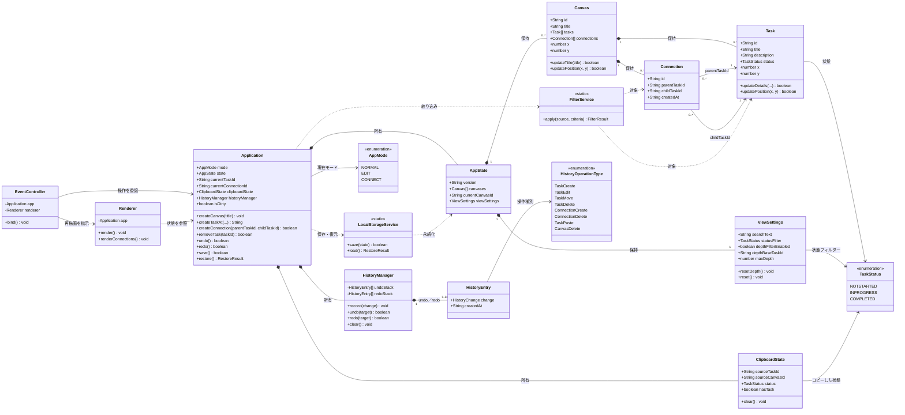

# UMLクラス図

現在の実装を、UI・アプリケーション・ドメイン・サービス／履歴の主要クラスに絞って示す。
型エイリアス、スナップショット、バリデーション関数、DOM要素などの詳細は省略している。

## レイヤーごとの役割

- `EventController` / `Renderer`: DOMイベントの受付と画面描画
- `Application`: ユースケースの実行、選択状態、編集モード、保存状態の統括
- `AppState` / `Canvas` / `Task` / `Connection`: アプリケーションの中心データ
- `FilterService` / `LocalStorageService`: 絞り込みとブラウザストレージへの永続化
- `HistoryManager`: スナップショットを利用した undo / redo
