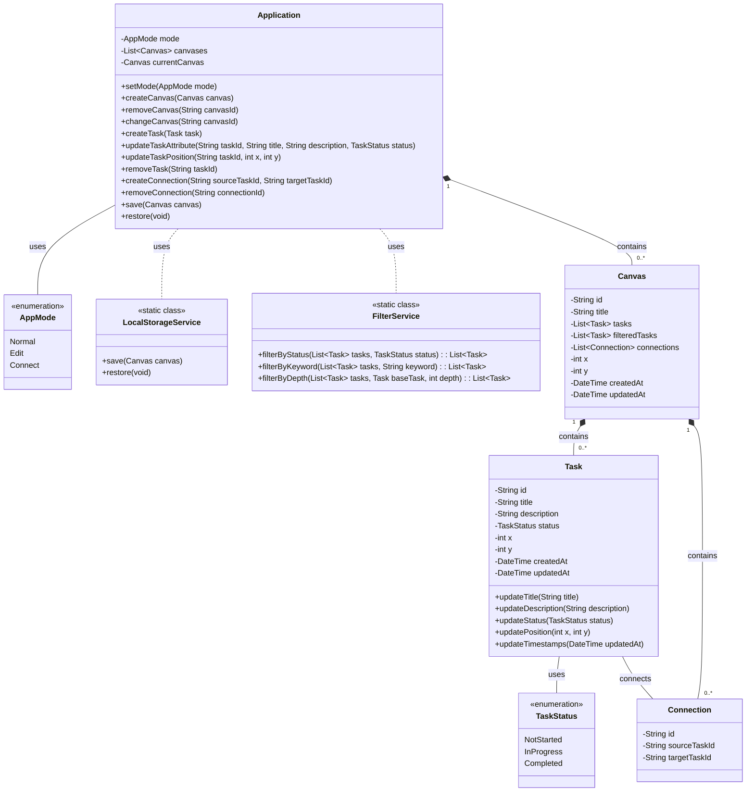

# UMLクラス図

```mermaid
classDiagram
    class Application{
        -AppMode mode
        -List~Canvas~ canvases
        -Canvas currentCanvas

        +setMode(AppMode mode)
        +createCanvas(Canvas canvas)
        +removeCanvas(String canvasId)
        +changeCanvas(String canvasId)
        +createTask(Task task)
        +updateTaskAttribute(String taskId, String title, String description, TaskStatus status)
        +updateTaskPosition(String taskId, int x, int y)
        +removeTask(String taskId)
        +createConnection(String sourceTaskId, String targetTaskId)
        +removeConnection(String connectionId)
        +save(Canvas canvas)
        +restore(void)
    }
    class AppMode {
        <<enumeration>>
        Normal
        Edit
        Connect
    }
    class LocalStorageService {
        <<static class>>
        +save(Canvas canvas)
        +restore(void)
    }

    class FilterService {
        <<static class>>
        +filterByStatus(List~Task~ tasks, TaskStatus status): List~Task~
        +filterByKeyword(List~Task~ tasks, String keyword): List~Task~
        +filterByDepth(List~Task~ tasks, Task baseTask, int depth): List~Task~
    }
    
    class Canvas {
        -String id
        -String title
        -List~Task~ tasks
        -List~Task~ filteredTasks
        -List~Connection~ connections
        -int x
        -int y
        -DateTime createdAt
        -DateTime updatedAt
    }

    class Task {
        -String id
        -String title
        -String description
        -TaskStatus status
        -int x
        -int y
        -DateTime createdAt
        -DateTime updatedAt

        +updateTitle(String title)
        +updateDescription(String description)
        +updateStatus(TaskStatus status)
        +updatePosition(int x, int y)
        +updateTimestamps(DateTime updatedAt)
    }
    class TaskStatus {
        <<enumeration>>
        NotStarted
        InProgress
        Completed
    }

    class Connection {
        -String id
        -String sourceTaskId
        -String targetTaskId
    }


    Application -- AppMode : uses
    Task -- TaskStatus : uses

    Application .. LocalStorageService : uses
    Application .. FilterService : uses

    Application "1" *-- "0..*" Canvas : contains
    Canvas "1" *-- "0..*" Task : contains
    Canvas "1" *-- "0..*" Connection : contains
    Task -- Connection : connects
```