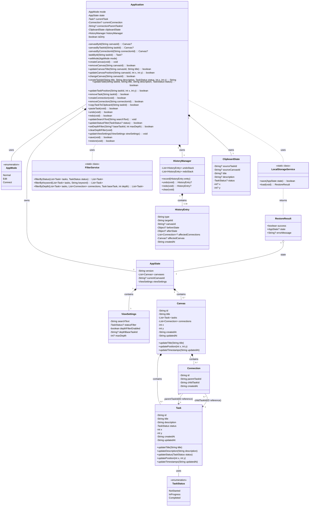

# UMLクラス図

```mermaid
classDiagram
    class AppState {
        -String version
        -List~Canvas~ canvases
        -String? currentCanvasId
        -ViewSettings viewSettings
    }
    class ViewSettings {
        -String searchText
        -TaskStatus? statusFilter
        -boolean depthFilterEnabled
        -String? depthBaseTaskId
        -int? maxDepth
    }
    
    class AppMode {
        <<enumeration>>
        Normal
        Edit
        Connect
    }
    class TaskStatus {
        <<enumeration>>
        NotStarted
        InProgress
        Completed
    }

    class LocalStorageService {
        <<static class>>
        +save(AppState state): boolean
        +load(void): RestoreResult
    }
    class RestoreResult {
        +boolean success
        +AppState? state
        +String? errorMessage
    }
    class FilterService {
        <<static class>>
        +filterByStatus(List~Task~ tasks, TaskStatus status): List~Task~
        +filterByKeyword(List~Task~ tasks, String keyword): List~Task~
        +filterByDepth(List~Task~ tasks, List~Connection~ connections, Task baseTask, int depth): List~Task~
    }
    class HistoryManager {
        -List~HistoryEntry~ undoStack
        -List~HistoryEntry~ redoStack

        +record(HistoryEntry entry)
        +undo(void): HistoryEntry?
        +redo(void): HistoryEntry?
        +clear(void)
    }
    class HistoryEntry {
        -String type
        -String targetId
        -String? canvasId
        -Object? beforeState
        -Object? afterState
        -List~Connection~? affectedConnections
        -Canvas? affectedCanvas
        -String createdAt
    }
    class ClipboardState {
        -String? sourceTaskId
        -String? sourceCanvasId
        -String? title
        -String? description
        -TaskStatus? status
        -int? x
        -int? y
    }

    class Application{
        -AppMode mode
        -AppState state
        -Task? currentTask
        -Connection? currentConnection
        -String? connectionParentTaskId
        -ClipboardState clipboardState
        -HistoryManager historyManager
        -boolean isDirty

        -canvasById(String canvasId): Canvas?
        -canvasByTaskId(String taskId): Canvas?
        -canvasByConnectionId(String connectionId): Canvas?
        -taskById(String taskId): Task?
        +setMode(AppMode mode)
        +createCanvas(void): void
        +removeCanvas(String canvasId): boolean
        +updateCanvasTitle(String canvasId, String title): boolean
        +updateCanvasPosition(String canvasId, int x, int y): boolean
        +changeCanvas(String canvasId): boolean
        +createTaskAt(String title, String description, TaskStatus status, int x, int y): String
        +updateTask(String taskId, String title, String description, TaskStatus status): boolean
        +updateTaskPosition(String taskId, int x, int y): boolean
        +removeTask(String taskId): boolean
        +createConnection(void): boolean
        +removeConnection(String connectionId): boolean
        +copyTaskToClipboard(String taskId): boolean
        +pasteTask(void): boolean
        +undo(void): boolean
        +redo(void): boolean
        +updateSearchText(String searchText): void
        +updateStatusFilter(TaskStatus? status): boolean
        +setDepthFilter(String? baseTaskId, int maxDepth): boolean
        +clearDepthFilter(void)
        +updateViewSettings(ViewSettings viewSettings): void
        +save(void): boolean
        +restore(void): boolean
    }
    class Canvas {
        -String id
        -String title
        -List~Task~ tasks
        -List~Connection~ connections
        -int x
        -int y
        -String createdAt
        -String updatedAt

        +updateTitle(String title)
        +updatePosition(int x, int y)
        +updateTimestamps(String updatedAt)
    }
    class Task {
        -String id
        -String title
        -String description
        -TaskStatus status
        -int x
        -int y
        -String createdAt
        -String updatedAt

        +updateTitle(String title)
        +updateDescription(String description)
        +updateStatus(TaskStatus status)
        +updatePosition(int x, int y)
        +updateTimestamps(String updatedAt)
    }
    class Connection {
        -String id
        -String parentTaskId
        -String childTaskId
        -String createdAt
    }


    Application -- AppMode : uses
    Task -- TaskStatus : uses

    AppState "1" *-- "1" ViewSettings : contains
    AppState "1" *-- "0..*" Canvas : contains

    Application "1" *-- "1" AppState : owns
    Application "1" *-- "1" ClipboardState : owns
    Application "1" *-- "1" HistoryManager : owns

    Application .. LocalStorageService : uses
    Application .. FilterService : uses
    LocalStorageService .. RestoreResult : returns
    RestoreResult "1" o-- "1" AppState : state

    Canvas "1" *-- "0..*" Task : contains
    Canvas "1" *-- "0..*" Connection : contains
    Connection "0..*" --> "1" Task : parentTaskId(ID reference)
    Connection "0..*" --> "1" Task : childTaskId(ID reference)
    HistoryManager "1" *-- "0..50" HistoryEntry : contains
```
